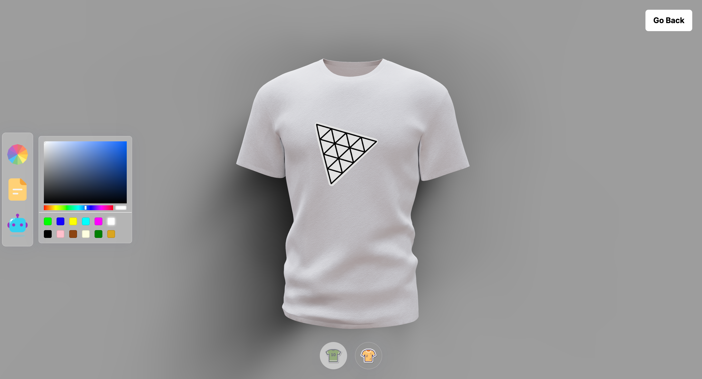

# 3D Shirt Shop

Welcome to the 3D A.I. Shirt Shop application! Dive into a unique shopping experience where you can customize shirts using advanced 3D graphics and A.I. algorithms.


## Demo


## 🌐 Visit the site:
aishirtshop.vercel.app/


## Overview
This application provides a 3D visualization of shirts. Users can customize the color and apply logos using A.I. assistance. The user interface is designed to be intuitive, ensuring a seamless experience for all users
## Features

- **A.I. Assistance:** Get Fabric & logo suggestions generated by A.I.
- Generate **custom textures** via AI image generation.
- Customize shirt color using a **color picker**.
- Real-time Preview: See your changes in a real-time **3D environment**.
- Apply textures/decals to **predefined shirt model** zones (full shirt, logo area, etc.)
- **Smooth 3D rendering** and interactions powered by Three.js and React Three Fiber


## Tech Stack
### Client
- React
- Vite
- Tailwind CSS
- Three.js
- React Three Fiber
- Valtio for state management

### Server  
- Node.js
- Express
- MongoDB
- OpenAI API - for AI image generation


## How to Use
- Navigate to the 3D A.I. Shirt Shop website.
- Change shirt color: Click the color picker and select a new color
- Add custom texture: Upload an image file using the file picker
- Generate AI texture: Enter a text prompt in the AI picker
- Apply textures: Click the shirt icons to toggle texture zones
- Interact with model: Orbit, zoom, and tap to rotate the 3D view
## Installation

To run the application locally:


- Clone the repository.
- Navigate to the project directory.
- Install dependencies using ```npm install.```
- Start the development server using ``` npm start.```

    
## Contributing

We welcome contributions from the community! If you find any bugs or have suggestions for improvement, please open an issue or submit a pull request.
